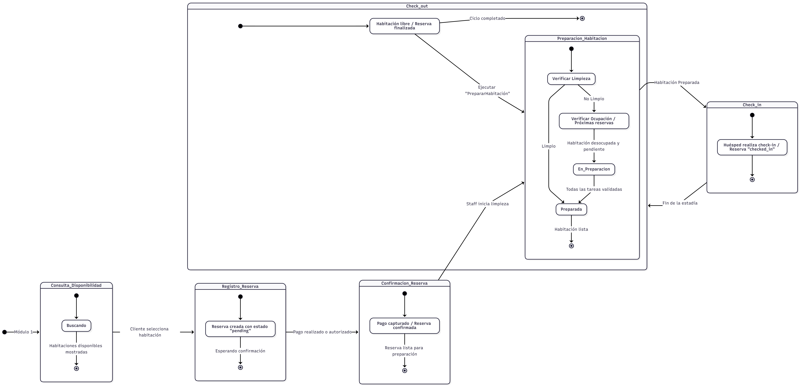

# Sistema de Gestión Hotelera

## Índice

1. [Relevamiento, Análisis y Diseño del Sistema](#1-relevamiento-análisis-y-diseño-del-sistema)
   - [1.1 Relevamiento](#11-relevamiento)
   - [1.2 Análisis](#12-análisis)
   - [1.3 Diseño del Sistema](#13-diseño-del-sistema)
   - [1.4 Objetivo General](#14-objetivo-general)
2. [DER (Diagrama entidad-relación)](#2-der-diagrama-entidad-relación)
3. [DFD (Diagrama de flujo de datos)](#3-dfd-diagrama-de-flujo-de-datos)
   - [3.1 Sistema en general](#31-sistema-en-general)
   - [3.2 Módulos](#32-módulos)
     - [3.2.1 Módulo 1](#321-módulo-1)
     - [3.2.2 Módulo 2](#322-módulo-2)
     - [3.2.3 Módulo 3](#323-módulo-3)
     - [3.2.4 Módulo 4](#324-módulo-4)
     - [3.2.5 Módulo 5](#325-módulo-5)
     - [3.2.6 Módulo 6](#326-módulo-6)
   - [3.3 Interpretación global](#33-interpretación-global)
4. [Diagrama de estados](#4-diagrama-de-estados)
5. [Desarrollo de módulos](#5-desarrollo-de-módulos)

---

## 1. Relevamiento, Análisis y Diseño del Sistema

### 1.1 Relevamiento

En el contexto de la gestión hotelera moderna, se identificó la necesidad de contar con un sistema informático que optimice los procesos vinculados al ciclo completo de la reserva de habitaciones.  
El relevamiento permitió detectar los principales puntos críticos en la operación cotidiana del hotel, como la falta de trazabilidad entre reservas, demoras en la confirmación de pagos y ausencia de un control centralizado sobre la preparación y asignación de habitaciones.

De este estudio preliminar surgieron los requerimientos funcionales esenciales:

- Consultar la disponibilidad de habitaciones en función de fechas, tipo y capacidad, sin alterar los datos operativos.  
- Registrar nuevas reservas asociadas a huéspedes, con validaciones sobre fechas, capacidad y políticas del establecimiento.  
- Confirmar reservas mediante la validación de pagos o garantías de estadía.  
- Gestionar la preparación de habitaciones asegurando el cumplimiento de los estándares de limpieza, mantenimiento y confort.  
- Controlar el proceso de check-in, registrando la ocupación efectiva y habilitando la atención personalizada al huésped.  

Asimismo, se identificó la necesidad de establecer registros históricos que permitan auditar cada operación, garantizando la transparencia y el seguimiento de las acciones realizadas por el personal.

---

### 1.2 Análisis

A partir del relevamiento, se determinaron cinco módulos funcionales que reflejan las etapas clave del ciclo de vida de una reserva hotelera:

- **Consulta de disponibilidad**: permite conocer las habitaciones libres en un rango determinado de fechas, aplicando filtros por tipo y capacidad.  
- **Registro de reserva**: genera una nueva reserva en estado pendiente, asociando los datos del huésped y el detalle de la solicitud.  
- **Confirmación de reserva**: actualiza el estado de la reserva a confirmada una vez verificado el pago o garantía correspondiente.  
- **Preparación de la habitación**: coordina las tareas internas previas al check-in, como limpieza, reposición de insumos y control de mantenimiento.  
- **Check-in y atención al huésped**: formaliza el ingreso del huésped, valida su identidad y marca la habitación como ocupada dentro del sistema.  

Los módulos se integran de manera secuencial y dependiente, garantizando que la salida de un proceso constituya la entrada del siguiente.  
Esta estructura minimiza errores operativos y refuerza la coherencia interna del sistema.

Se determinó además la importancia de incorporar reglas de negocio estrictas (validaciones de fechas, capacidades y estados de reserva) para evitar conflictos como sobreasignaciones, reservas duplicadas o habitaciones no preparadas a tiempo.

---

### 1.3 Diseño del Sistema

El sistema fue concebido bajo una arquitectura modular y escalable, en la que cada proceso mantiene independencia lógica, pero se integra dentro de un flujo general coherente.  

Cada módulo se define por los siguientes componentes:

- **Entradas:** datos necesarios para su ejecución (fechas, ID de habitación, datos del huésped, etc.).  
- **Reglas de validación:** restricciones y condiciones de negocio para asegurar la consistencia de la información.  
- **Salidas:** resultados del proceso (estado de la reserva, habitación asignada, comprobante, etc.).  
- **Algoritmo:** secuencia de pasos operativos con distintos niveles de refinamiento.  
- **Pseudocódigo:** representación formal del flujo lógico que facilita la implementación.  

El diseño busca garantizar:

- Trazabilidad completa entre las distintas etapas de una reserva.  
- Integridad de los datos relacionados con huéspedes, habitaciones y transacciones.  
- Secuencialidad y coherencia en la gestión de cada proceso operativo.  
- Facilidad de mantenimiento y extensión futura, permitiendo agregar funcionalidades (check-out, facturación, reportes, etc.) sin alterar la estructura base.

---

### 1.4 Objetivo General

Desarrollar un sistema integral de gestión hotelera que administre de forma ordenada y eficiente el ciclo completo de una reserva —desde la consulta inicial hasta el check-in—, garantizando la consistencia de los datos, la eficiencia operativa y una experiencia fluida tanto para el huésped como para el personal del hotel.  

El sistema busca modernizar la operatoria interna, reducir errores humanos y establecer una base sólida para futuras mejoras tecnológicas, como la integración con plataformas de reservas en línea o sistemas de gestión contable.

---

## 2. DER (Diagrama entidad-relación)

El Diagrama Entidad–Relación (DER) define la estructura lógica de los datos que componen el sistema de gestión hotelera. Este modelo permite visualizar las entidades principales del sistema, sus atributos y las relaciones existentes entre ellas, asegurando la integridad y consistencia de la información a lo largo de todo el proceso operativo.

El diseño presentado contempla cinco entidades principales:

- **Persona:** almacena los datos personales y de contacto tanto de huéspedes como del personal del hotel. Incluye campos como nombre, DNI, correo electrónico, teléfono y tipo de persona (cliente o staff).  
- **Reserva:** representa el núcleo del sistema. Registra las operaciones de reserva de habitaciones, vinculando un huésped con una habitación durante un rango de fechas determinado.  
- **Habitación:** modela las unidades físicas del hotel. Cada registro posee atributos de capacidad, tarifa, estado actual (disponible, ocupada, en preparación) y fecha de habilitación.  
- **Pago:** almacena la información de los pagos efectuados para confirmar reservas. Incluye monto, moneda, método de pago, estado y fecha de creación.  
- **Tarea:** representa las actividades operativas relacionadas con la preparación de las habitaciones (limpieza, reposición, mantenimiento).  

Relaciones principales:

- Una Persona puede generar muchas Reservas (1:N).  
- Una Reserva está asociada a una sola Habitación, pero una habitación puede tener muchas Reservas a lo largo del tiempo (N:1).  
- Una Reserva puede estar vinculada con uno o más Pagos (1:N).  
- Una Habitación puede tener muchas Tareas asignadas (1:N).  

El modelo refleja un esquema relacional normalizado que favorece la integridad referencial y evita redundancias.

---

## 3. DFD (Diagrama de flujo de datos)

### 3.1 Sistema en general

El DFD general (nivel 0) presenta una visión integrada de los cinco procesos que conforman el ciclo operativo del sistema hotelero.  
Cada proceso se encuentra interconectado de forma lógica, evidenciando la dependencia secuencial entre los módulos: desde la consulta inicial hasta el check-in efectivo del huésped.

Principales flujos identificados:

- Interacción con el huésped (consulta → check-in).  
- Procesos administrativos del personal del hotel y sistema de pagos.  
- Bases de datos centrales: Habitación, Reserva, Pago, Persona y Tarea.

Este nivel permite comprender el funcionamiento global del sistema como un ecosistema integrado, donde cada módulo realiza una función específica y contribuye a mantener la coherencia del flujo operativo.

---

### 3.2 Módulos

#### 3.2.1 Módulo 1

Representa el punto de partida del proceso de reservas.  
El huésped ingresa un rango de fechas y la cantidad de huéspedes. El sistema consulta las bases de datos y devuelve habitaciones disponibles.

- **Entradas:** fechas, cantidad de huéspedes.  
- **Salidas:** listado filtrado de habitaciones disponibles.  
- **Almacenamientos:** Habitación, Reserva.
  
El proceso no genera modificaciones ni bloqueos de datos, respetando el principio de no mutación del sistema en la etapa de consulta.

---

#### 3.2.2 Módulo 2

Crea una reserva preliminar (estado `pendiente`).  
El huésped ingresa sus datos y selecciona una habitación disponible. Se verifica solapamiento, se registra el huésped si no existe y se crea la reserva temporal.

- **Entradas:** datos del huésped, habitación seleccionada.  
- **Salidas:** confirmación provisional, número de reserva.  
- **Almacenamientos:** Persona, Habitación, Reserva.  }

Este módulo inicia la persistencia de datos, ya que introduce registros nuevos que serán validados en los siguientes procesos.

---

#### 3.2.3 Módulo 3

Formaliza la reserva mediante la validación del pago.  
Si el pago se aprueba, se actualiza la reserva a `confirmada` y la habitación a reservada.

- **Entradas:** datos de pago, reserva pendiente.  
- **Salidas:** comprobante de confirmación, actualización de estado.  
- **Almacenamientos:** Pago, Reserva, Habitación.

Este módulo es clave porque consolida la coherencia financiera y operativa del proceso, garantizando que solo reservas con pago válido avancen al siguiente paso.

---

#### 3.2.4 Módulo 4

Gestiona el flujo interno de preparación de habitaciones.  
Tras la confirmación de reserva, se generan tareas (limpieza, mantenimiento, reposición) a completar antes del check-in.

- **Entradas:** confirmación de reserva, personal disponible.  
- **Salidas:** habitación marcada como preparada.  
- **Almacenamientos:** Tarea, Habitación, Reserva.

El proceso promueve la gestión de calidad interna, permitiendo al hotel mantener un registro digital del estado de las tareas y el cumplimiento de los plazos operativos.

---

#### 3.2.5 Módulo 5

Etapa final del ciclo operativo (check-in).  
El huésped se presenta con su documento y número de reserva; el sistema valida y actualiza estados a `ocupada` y `checked_in`.

- **Entradas:** reserva confirmada, identificación del huésped.  
- **Salidas:** notificación de check-in exitoso, habitación ocupada.  
- **Almacenamientos:** Reserva, Habitación.

Este proceso cierra el flujo de la reserva garantizando consistencia entre la información administrativa y la ocupación real.

---

#### 3.2.6 Módulo 6

El diagrama de flujo de datos del Módulo 6 – Check-out representa la etapa final del ciclo operativo del sistema.
El proceso se ejecuta una vez que el huésped ha completado su estadía.
El personal del hotel activa el procedimiento de check-out, que tiene como propósito liberar la habitación, finalizar la reserva y preparar la unidad para el próximo ingreso.

- **Entradas:**
   - Identificador de habitación (habitacion_id)
   - Identificador de reserva (reserva_id)
   - Orden del staff para ejecutar el check-out

- **Procesos:**
  - Liberar habitación:cambia el estado de la habitación de ocupada a libre.  
  - Finalizar reserva: actualiza el estado de la reserva a finalizada.  
  - Preparar habitación: invoca el módulo de Preparación de Habitación para reestablecer el estado y las tareas asociadas.
     
- **Salidas:**
   - Habitación en estado libre y disponible para una nueva reserva.
   - Reserva actualizada como finalizada.
   - Confirmación de check-out enviada al staff.

- **Almacenamientos:**
   - Habitación: refleja el cambio de estado a libre.
   - Reserva: guarda el estado finalizada.
   - Tarea: se activa el proceso de Preparación de Habitación.
 
Descripción general:
Este módulo completa el ciclo operativo del sistema hotelero.
A partir de la acción del personal, se sincronizan los estados administrativos y físicos: la habitación se libera, la reserva se cierra y el proceso de limpieza y acondicionamiento vuelve a dejar la unidad lista para una nueva ocupación.
De esta manera, se garantiza la continuidad del flujo y la coherencia entre la información almacenada y el estado real de las instalaciones.
  

---

### 3.3 Interpretación global

Los DFD demuestran cómo el sistema opera de forma modular, segura y controlada.  
Cada flujo garantiza una transformación válida de datos: entrada → procesamiento → salida.  

Además, la descomposición progresiva permite:

- Identificar puntos críticos (pagos, validaciones).  
- Mantener una visión jerárquica del flujo de información.  
- Alinear el modelo funcional (DFD) con el modelo de datos (DER).

---
## 4. Diagrama de estados
El siguiente diagrama de estados resume el ciclo de vida completo de una reserva dentro del sistema de gestión hotelera.  
Integra las transiciones entre los distintos módulos operativos —desde la consulta de disponibilidad hasta el check-out— reflejando cómo los estados de **habitaciones** y **reservas** evolucionan de forma sincronizada.

  

### Interpretación

El modelo muestra un flujo continuo y cerrado de operaciones que garantiza la coherencia entre los procesos administrativos y operativos del hotel:

- **Inicio del ciclo:** el huésped consulta la disponibilidad (`Consulta_Disponibilidad`) y selecciona una habitación.  
  Este estado inicial no altera datos, solo filtra opciones según capacidad y fechas.

- **Creación de reserva:** tras la selección, el sistema genera una **reserva en estado `pending`** (`Registro_Reserva`), asegurando el bloqueo temporal de la habitación mientras se espera la confirmación del pago.

- **Confirmación de reserva:** una vez capturado o autorizado el pago (`Confirmacion_Reserva`), la reserva pasa a estado **`confirmed`**, habilitando la fase operativa de preparación.

- **Preparación de habitación:** el módulo interno (`Preparacion_Habitacion`) gestiona tareas como limpieza, mantenimiento o reposición.  
  Este subproceso controla los estados **`En_Preparacion`** y **`Preparada`**, evitando que se asigne una habitación sin validar.

- **Check-in:** cuando la habitación está lista, el huésped realiza el ingreso y la reserva cambia a **`checked_in`**.  
  Este paso consolida la ocupación efectiva y marca el inicio de la estadía.

- **Check-out:** al finalizar la estadía, el staff ejecuta el cierre del ciclo.  
  La habitación se libera, la reserva pasa a **`finalizada`**, y se re-invoca el proceso de preparación, garantizando la continuidad del flujo operativo.

### Observaciones

Este modelo permite visualizar:

- La **dependencia jerárquica** entre los módulos del sistema (cada estado habilita el siguiente).  
- El **control transaccional** de cada etapa, asegurando que ninguna habitación avance a un estado inconsistente.  
- La **reutilización de subprocesos** (como la preparación de habitación) en distintos contextos del ciclo.  
- Una arquitectura **determinística y trazable**, ideal para implementar mediante máquinas de estados o controladores por eventos.

En conjunto, el diagrama valida que el sistema mantiene **integridad operacional** en todo momento, alineando las acciones del huésped, el staff y la base de datos dentro de un mismo flujo lógico.

## 5. Desarrollo de módulos
*(contenido a continuar aquí)*
